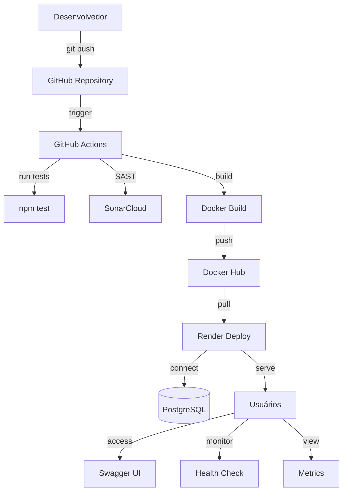

# 🔐 API P2 - DevSecOps CI/CD Pipeline


[](https://sonarcloud.io/summary/new_code?id=Adejarbas_api-p2)
[](https://sonarcloud.io/summary/new_code?id=Adejarbas_api-p2)

> **⚠️ ATENÇÃO:** Esta API contém vulnerabilidades intencionais para fins educacionais. **NÃO USE EM PRODUÇÃO!**

API REST desenvolvida para o Projeto P2 da disciplina de DevSecOps, demonstrando implementação completa de pipeline CI/CD com análise SAST, containerização Docker e deploy automatizado.

---

## 📋 Sobre o Projeto

Projeto acadêmico (P2) focado em **Integração e Entrega Contínua (CI/CD)** com ênfase em **DevSecOps**. A aplicação é uma API REST com vulnerabilidades intencionais para demonstrar ferramentas de análise estática de segurança (SAST).

### 🎯 Objetivos

- ✅ Implementar pipeline CI/CD completo
- ✅ Integrar ferramentas SAST (SonarCloud)
- ✅ Automatizar build e deploy com Docker
- ✅ Demonstrar boas práticas de DevOps
- ✅ Configurar monitoramento e logs estruturados

---

## 🚀 Links Importantes

| Recurso | URL |
|---------|-----|
| **API em Produção** | https://api-p2-latest.onrender.com |
| **Swagger UI** | https://api-p2-latest.onrender.com/api-docs |
| **Health Check** | https://api-p2-latest.onrender.com/health |
| **Métricas** | https://api-p2-latest.onrender.com/metrics |
| **GitHub Actions** | https://github.com/Adejarbas/api-p2/actions |
| **SonarCloud** | https://sonarcloud.io/project/overview?id=Adejarbas_api-p2 |
| **Docker Hub** | https://hub.docker.com/r/danielrodriguesadejarbas/api-p2 |

---

## 🏗️ Arquitetura



---

## ⚙️ Tecnologias

### Backend
- **Node.js 18** + **Express**
- **PostgreSQL** (Render)
- **Winston** (Logs estruturados)
- **Morgan** (HTTP logging)
- **Swagger UI** (Documentação)

### DevOps
- **GitHub Actions** (CI/CD)
- **Docker** (Containerização)
- **Docker Hub** (Registry)
- **Render** (Hosting)
- **SonarCloud** (SAST)

---

## 📦 Funcionalidades

### API REST
- ✅ CRUD completo de usuários
- ✅ Endpoints vulneráveis (para SAST)
- ✅ Documentação Swagger
- ✅ Health checks
- ✅ Métricas de performance

### Monitoramento
- ✅ Logs estruturados (JSON)
- ✅ HTTP request logging
- ✅ Error handling centralizado
- ✅ Performance metrics

### Segurança (Vulnerabilidades Intencionais)
- ⚠️ SQL Injection
- ⚠️ Command Injection
- ⚠️ XSS (Cross-Site Scripting)
- ⚠️ Path Traversal
- ⚠️ Weak Cryptography
- ⚠️ Hardcoded Credentials
- ⚠️ SSRF
- ⚠️ Code Injection

---

## 🚀 Começando

### Pré-requisitos

- Node.js 18+
- PostgreSQL (ou usar banco do Render)
- Docker (opcional, para testes locais)

### Instalação Local

```bash
# Clone o repositório
git clone https://github.com/Adejarbas/api-p2.git
cd api-p2

# Instale as dependências
npm install

# Configure variáveis de ambiente
cp .env.example .env
# Edite .env com suas credenciais

# Execute a aplicação
npm start
```

A API estará disponível em: `http://localhost:3000`

### Variáveis de Ambiente

```env
# Banco de Dados
DB_HOST=localhost
DB_PORT=5432
DB_NAME=api_p2
DB_USER=postgres
DB_PASSWORD=sua_senha

# Aplicação
NODE_ENV=development
PORT=3000
```

---

## 🐳 Docker

### Build Local

```bash
# Build da imagem
docker build -t api-p2:latest .

# Executar container
docker run -p 3000:3000 \
  -e DB_HOST=seu_host \
  -e DB_PORT=5432 \
  -e DB_NAME=api_p2 \
  -e DB_USER=seu_usuario \
  -e DB_PASSWORD=sua_senha \
  api-p2:latest
```

### Docker Hub

Imagens disponíveis em: `danielrodriguesadejarbas/api-p2`

```bash
# Pull da imagem
docker pull danielrodriguesadejarbas/api-p2:latest

# Executar
docker run -p 3000:3000 danielrodriguesadejarbas/api-p2:latest
```

---

## 🔄 CI/CD Pipeline

### Workflow CI (`.github/workflows/ci.yml`)

**Triggers:** Push e Pull Request para `main`

**Steps:**
1. ✅ Checkout do código
2. ✅ Setup Node.js
3. ✅ Instalação de dependências (`npm ci`)
4. ✅ Execução de testes (`npm test`)
5. ✅ **Análise SAST com SonarCloud**

### Workflow CD (`.github/workflows/docker-build.yml`)

**Triggers:** Push de tags (`v*`)

**Steps:**
1. ✅ Checkout do código
2. ✅ Geração de versão semântica
3. ✅ Build da imagem Docker
4. ✅ Push para Docker Hub (versão + latest)
5. ✅ Deploy automático no Render

---

## 🔍 SonarCloud (SAST)

### Dashboard

Acesse: https://sonarcloud.io/project/overview?id=Adejarbas_api-p2

### Vulnerabilidades Detectadas

- **8 Security Hotspots** (intencionais)
- **Quality Gate:** Failed (esperado)
- **Análise automática** a cada push

### Configuração

Arquivo: `sonar-project.properties`

```properties
sonar.projectKey=Adejarbas_api-p2
sonar.organization=adejarbas
sonar.sources=src
sonar.exclusions=node_modules/**,tests/**
```

---

## 📊 Endpoints

### Documentação Interativa
```
GET /api-docs
```
Interface Swagger com todos os endpoints documentados.

### CRUD de Usuários
```
GET    /api/users       # Listar todos
POST   /api/users       # Criar novo
GET    /api/users/:id   # Buscar por ID
PUT    /api/users/:id   # Atualizar
DELETE /api/users/:id   # Deletar
```

### Monitoramento
```
GET /health    # Status da aplicação e banco
GET /metrics   # Métricas de performance
```

### Endpoints Vulneráveis (SAST)
```
GET  /users/:id         # SQL Injection
POST /execute           # Command Injection
GET  /download          # Path Traversal
GET  /search            # XSS
POST /encrypt           # Weak Cryptography
GET  /fetch             # SSRF
POST /eval              # Code Injection
```

---

## 📁 Estrutura do Projeto

```
api-p2/
├── .github/
│   └── workflows/
│       ├── ci.yml              # CI: testes + SonarCloud
│       └── docker-build.yml    # CD: build + push Docker
├── src/
│   ├── config/
│   │   └── logger.js           # Configuração Winston
│   ├── middleware/
│   │   ├── errorHandler.js     # Error handling
│   │   ├── logging.js          # HTTP logging (Morgan)
│   │   └── metrics.js          # Métricas de performance
│   ├── routes/
│   │   ├── health.js           # Health check
│   │   └── users.js            # CRUD de usuários
│   └── app.js                  # Aplicação principal
├── tests/
│   └── app.test.js             # Testes
├── .dockerignore               # Arquivos ignorados no Docker
├── .env.example                # Exemplo de variáveis
├── .gitignore                  # Arquivos ignorados no Git
├── CONTRIBUTING.md             # Guia de contribuição
├── Dockerfile                  # Imagem Docker
├── package.json                # Dependências
├── README.md                   # Este arquivo
└── sonar-project.properties    # Configuração SonarCloud
```

---

## 🧪 Testes

### Executar Testes

```bash
npm test
```

### Cobertura

```bash
npm run test:coverage
```

---

## 📝 Desenvolvimento

### Gitflow

- **main:** Produção
- **develop:** Desenvolvimento

### Conventional Commits

Seguimos o padrão de [Conventional Commits](./CONTRIBUTING.md):

```
feat: adiciona novo endpoint
fix: corrige erro de validação
chore: atualiza dependências
docs: atualiza README
```

---

## 🚢 Deploy

### Render

1. **Web Service:** `api-p2-latest`
2. **Runtime:** Docker
3. **Image:** `docker.io/danielrodriguesadejarbas/api-p2:latest`
4. **Banco:** PostgreSQL (Render)

### Variáveis de Ambiente (Render)

```
DB_HOST=<render_postgres_host>
DB_PORT=5432
DB_NAME=api_p2
DB_USER=api_p2_user
DB_PASSWORD=<senha>
NODE_ENV=production
PORT=3000
```


---

## 📄 Licença

Este projeto é para fins educacionais. Não use em produção.

---

## 👨‍💻 Autor

**Daniel Rodrigues Adejarbas**

- GitHub: [@Adejarbas](https://github.com/Adejarbas)
- Docker Hub: [danielrodriguesadejarbas](https://hub.docker.com/u/danielrodriguesadejarbas)

---

## 🙏 Agradecimentos

- Professor: **Felipe medeiros**
- Código base: [api-sast](https://github.com/festmedeiros/api-sast)
- Ferramentas: GitHub Actions, SonarCloud, Docker, Render

---

## ⚠️ Avisos Importantes

1. **Vulnerabilidades Intencionais:** Esta API contém falhas de segurança propositais para demonstração de ferramentas SAST.
2. **Não use em produção:** O código não deve ser usado em ambientes reais.
3. **Fins educacionais:** Projeto desenvolvido exclusivamente para aprendizado de DevSecOps.

---


